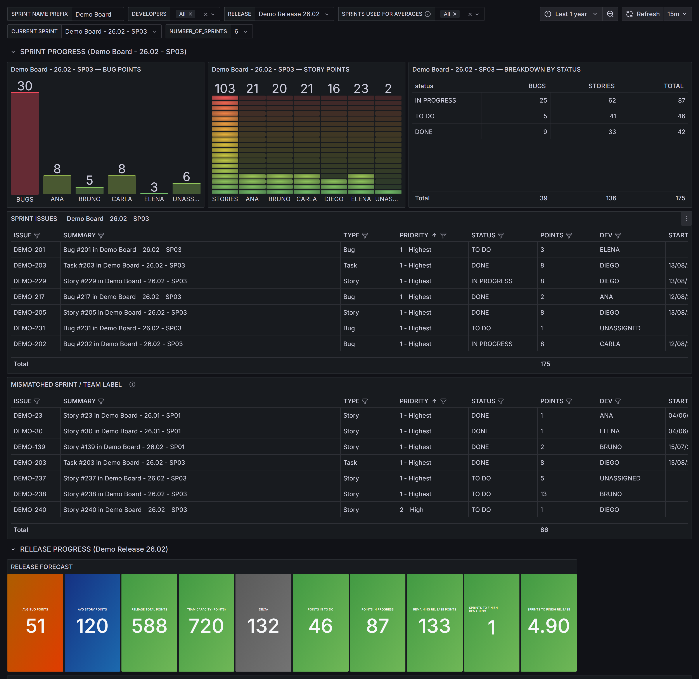
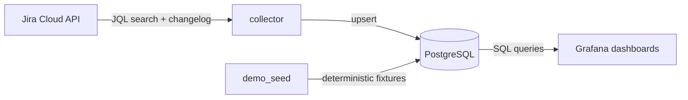

# Jira Metrics Dashboard

A Jira → PostgreSQL → Grafana pipeline that turns sprint and release data into delivery-metrics dashboards. Ships with a deterministic demo dataset, so the whole stack runs and shows populated dashboards with zero Jira credentials.



## How it works



The collector polls the Jira Cloud REST API (`/rest/api/3/search/jql`) for a single project, maps each issue into a flat row (status, story points, sprint, release, assignee, priority, changelog-derived start/resolve dates), and upserts it into PostgreSQL. Grafana is provisioned with a datasource and a dashboard that read straight from that table — no data-source config through the UI.

## Quick start (no Jira account)

```bash
cp .env.example .env
docker compose up -d
```

This starts PostgreSQL and Grafana, applies the database migration, and seeds ~240 deterministic demo issues (`jira-metrics seed --reset`) — no `JIRA_*` variables required.

Open http://localhost:3000 (`admin` / `admin`) and follow the **Jira Delivery Metrics** dashboard link, or go straight to http://localhost:3000/d/jira-delivery-metrics.

To tear everything down:

```bash
docker compose down -v
```

## Connect your own Jira

1. Fill in the four required variables in `.env`:

   ```
   JIRA_BASE_URL=https://your-company.atlassian.net
   JIRA_USER=you@example.com
   JIRA_TOKEN=your-api-token
   JIRA_PROJECT=YOUR_PROJECT_KEY
   ```

   Generate a token at https://id.atlassian.com/manage-profile/security/api-tokens.

2. Story points and sprint live on custom fields that differ per Jira instance. Discover yours:

   ```bash
   uv run jira-metrics fields --contains "Story Point"
   uv run jira-metrics fields --contains "Sprint"
   ```

   Set `JIRA_FIELD_STORY_POINTS` and `JIRA_FIELD_SPRINT` to the ids printed above.

3. Start the real collector alongside the rest of the stack:

   ```bash
   docker compose --profile live up -d
   ```

   The `collector` service polls Jira every `FETCH_INTERVAL_SECONDS` (default 600s) and upserts into the same database the demo seed used — running `jira-metrics seed --reset` again only ever touches `DEMO-*` rows, so it's safe to mix demo and real data while you experiment.

4. In the dashboard, set the **SPRINT NAME PREFIX** template variable to whatever prefix your own sprints share (the demo data uses `Demo Board`), so the mismatched-label panel targets your sprints instead.

## Environment variables

| Var | Required | Default | Notes |
|---|---|---|---|
| `JIRA_BASE_URL` | for `collect`/`fields` | — | trailing `/` stripped |
| `JIRA_USER` | for `collect`/`fields` | — | |
| `JIRA_TOKEN` | for `collect`/`fields` | — | |
| `JIRA_PROJECT` | for `collect` | — | Jira project key |
| `JIRA_LABELS` | no | `""` | comma list → JQL `labels IN (...)` |
| `JIRA_TEAM_LABEL` | no | `""` | single label → `has_team_label` |
| `JIRA_FIELD_STORY_POINTS` | no | `customfield_10016` | discover with `jira-metrics fields` |
| `JIRA_FIELD_SPRINT` | no | `customfield_10020` | discover with `jira-metrics fields` |
| `JIRA_PAGE_SIZE` | no | `100` | |
| `FETCH_INTERVAL_SECONDS` | no | `600` | delay between collector runs |
| `DATABASE_URI` | no | `postgresql+psycopg` | SQLAlchemy driver |
| `DATABASE_HOST` | no | `postgres` | |
| `DATABASE_PORT` | no | `5432` | |
| `DATABASE_USER` | no | `postgres` | |
| `DATABASE_PASSWORD` | no | `postgres` | |
| `DATABASE_NAME` | no | `metrics` | |
| `SQLALCHEMY_ECHO` | no | `false` | |
| `SQLALCHEMY_POOL_SIZE` | no | `20` | |
| `SQLALCHEMY_MAX_OVERFLOW` | no | `10` | |
| `SQLALCHEMY_POOL_PRE_PING` | no | `true` | |
| `DEBUGPY_ENABLE` | no | `false` | see Debugging below |
| `DEBUGPY_WAIT` | no | `false` | |
| `DEBUGPY_PORT` | no | `5678` | |
| `LOG_LEVEL` | no | `INFO` | |

## Data model

Single table, `jira_issues` (see `migrations/versions/0001_create_jira_issues.py`):

| Column | Notes |
|---|---|
| `issue_key` | unique, e.g. `DEMO-42` |
| `status`, `issue_type`, `summary` | |
| `story_points` | coerced to an int, defaults to 0 |
| `created`, `started`, `resolved` | `started`/`resolved` come from the changelog's earliest `In Progress`/`Done` transition |
| `assignee`, `parent`, `priority_id`, `priority_name` | |
| `sprint_name`, `release` | release is the pipe-joined `fixVersions` list |
| `has_team_label` | true when the issue carries `JIRA_TEAM_LABEL` |

A full sync (`jira-metrics collect`) deletes rows that are no longer returned by the JQL and are not `DONE`, keeping the table in sync with Jira without ever dropping resolved history. The demo seed only ever touches `DEMO-*` rows.

## Local development

```bash
uv sync --all-groups
uv run pytest --cov=jira_metrics --cov-report=term-missing
uv run ruff check .
uv run ruff format .
```

Run a single collection pass against a local Postgres:

```bash
uv run jira-metrics migrate
uv run jira-metrics seed --reset
uv run jira-metrics collect --once
```

## Debugging the collector in a container

`docker-compose.debug.yml` adds a `debugpy` listener to the `collector` service:

```bash
docker compose -f docker-compose.yml -f docker-compose.debug.yml --profile live up -d
```

The collector waits for a debugger to attach on `localhost:5678` before running (`DEBUGPY_WAIT=true`). The default `docker compose up` never loads `debugpy` and never blocks on it.

## Troubleshooting

- **Dashboard panels are empty** — check that the `PostgreSQL` datasource is green (Grafana → Connections → Data sources); `docker compose logs migrate seed` shows whether the migration/seed steps completed.
- **`docker compose up` seems to hang** — this used to happen when `debugpy` was wired into the default entrypoint; the current `docker-compose.yml` never sets `DEBUGPY_ENABLE`, so it should not occur. If it does, run `docker compose logs collector`.
- **Jira 401/403** — confirm `JIRA_BASE_URL`, `JIRA_USER`, `JIRA_TOKEN`, and that the token's user can view the project.
- **Wrong story points / sprint values** — your Jira instance almost certainly uses different custom field ids than the defaults; run `jira-metrics fields --contains "Story Point"` and set `JIRA_FIELD_STORY_POINTS`/`JIRA_FIELD_SPRINT` accordingly.

## License

MIT — see [LICENSE](LICENSE).
